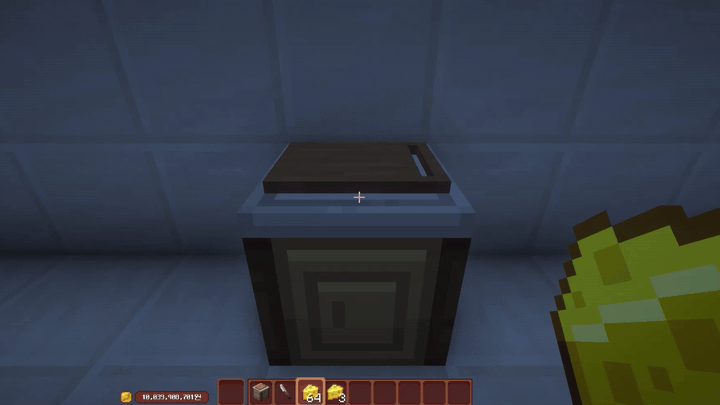
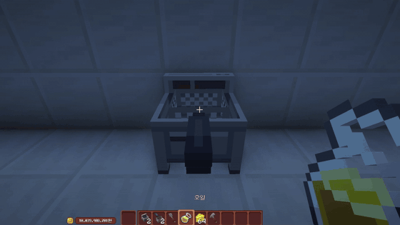
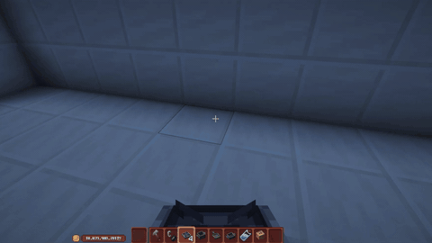
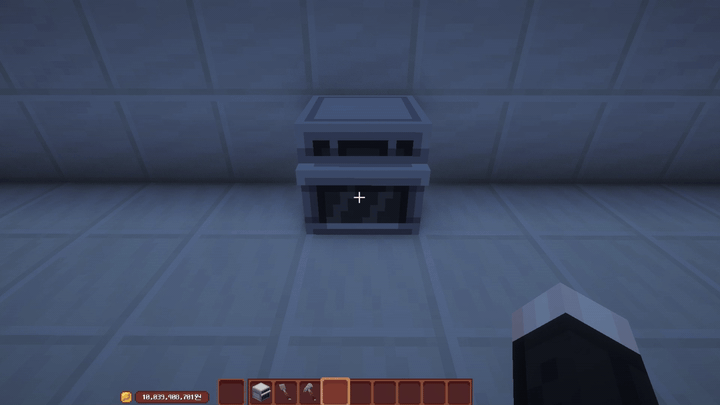
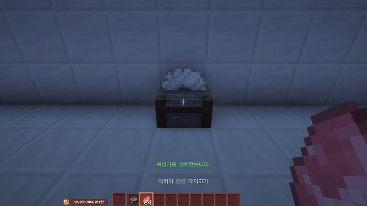

# 조리 도구

**도구마다 설치 방법과 사용법이 다릅니다.**
바닥에 설치하는 도구가 있고, 다른 것 위에 올려야 작동하는 도구가 있습니다.

## 공통 사용법

1.  :material-hand-back-right: **손에 도구를 듭니다**{ .flow-title }

    **도마는 식칼**, 나머지는 전부 **뒤집개**가 필요합니다.

2.  :material-basket-fill: **재료를 넣습니다**{ .flow-title }

    재료를 손에 들고 조리 도구를 **우클릭**하면 들어갑니다.

3.  :material-play: **조리를 시작합니다**{ .flow-title }

    식칼이나 뒤집개를 들고 **우클릭**하면 조리가 시작됩니다.

!!! tip "레시피 확인은 Shift + 우클릭"
    뒤집개를 들고 조리 도구를 ++shift++ + 우클릭 하면 배운 레시피를 볼 수 있습니다.
    → [레시피 시스템](recipes.md)

## 설치 방법

| 조리 도구 | 필요한 손도구 | 설치 방법 |
|---|---|---|
| **도마** | 식칼 | 바닥에 설치 |
| **튀김기** (뜰채 포함) | 뒤집개 | 바닥에 설치 |
| **오븐** | 뒤집개 | 바닥에 설치 |
| **육절기** | — | 바닥에 설치 |
| **냄비** | 뒤집개 | **가스레인지 또는 인덕션 위** |
| **프라이팬** | 뒤집개 | **가스레인지 또는 인덕션 위** |
| **찜기** | 뒤집개 | **물을 넣은 소형 냄비 위** |

## 도마

재료를 **우클릭**해서 도마 위에 올린 뒤, **식칼을 들고 우클릭**하면 썰 수 있습니다.
**꾹 누르고 있어도** 됩니다.

## 튀김기

1.  :material-cog: **뜰채를 장착합니다**{ .flow-title }

2.  :material-oil: **오일을 채웁니다**{ .flow-title }

    오일 하나로 **4번** 튀길 수 있습니다.

3.  :material-play: **재료를 넣고 뒤집개로 우클릭합니다**{ .flow-title }

## 냄비 · 프라이팬 · 찜기

이 셋은 **혼자서는 작동하지 않습니다.** 아래에 받칠 것이 필요합니다.

| 도구 | 올려야 하는 곳 |
|---|---|
| 냄비 · 프라이팬 | **가스레인지** 또는 **인덕션** 위 |
| 찜기 | **물을 넣은 소형 냄비** 위 |

설치한 뒤에는 다른 도구와 같습니다. 재료를 넣고 **뒤집개로 우클릭**하면 조리됩니다.

### 인덕션

**조리대 위에 올려서** 사용합니다.

### 가스레인지

설치 위치에 제한이 없습니다. 어디에나 놓을 수 있습니다.
다만 **라이터로 불을 붙여야** 조리가 시작됩니다.

## 오븐

오븐은 **문을 여닫는 동작**이 있습니다.

- **맨손으로 우클릭**하면 문이 열리고 닫힙니다.
- 문을 **연 상태에서만** 재료를 넣을 수 있습니다.
- 문을 **닫아야** 조리가 시작됩니다.

## 육절기

**돼지고기 · 소고기 · 닭고기**를 손질해 **부분육**을 얻는 도구입니다.

고기를 **손에 들고 우클릭**하면 가공됩니다.

고기는 [목장](../work/ranch.md)에서 얻습니다.

## 도구 구매

마을 **요리 회관**에서 조리 도구를 구매합니다.
