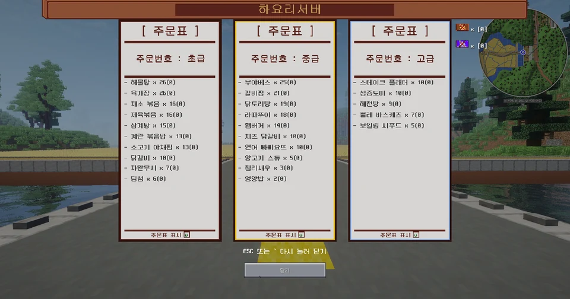

# 단축키

| 키 | 기능 |
|---|---|
| ++tilde++ | 주문표 열기 |
| ++alt++ | 마우스 표시 |
| ++shift+f++ | 건차 관리 메뉴 |

## 주문표

++tilde++ 를 누르면 **주문표**가 열립니다.

주문표 아래의 **체크 박스**를 클릭하면 기본 상태에서 주문표가 보이지 않게 할 수 있습니다.

## 마우스 표시

++alt++ 를 누르면 기본 상태에서 **마우스를 움직일 수 있습니다.**

## 건차 관리 메뉴

**자신 소유의 땅 안에서** ++shift+f++ 를 누르면 **건차 관리 메뉴**가 열립니다.

[:octicons-arrow-right-24: 토지 문서 보기](../start/land.md)
