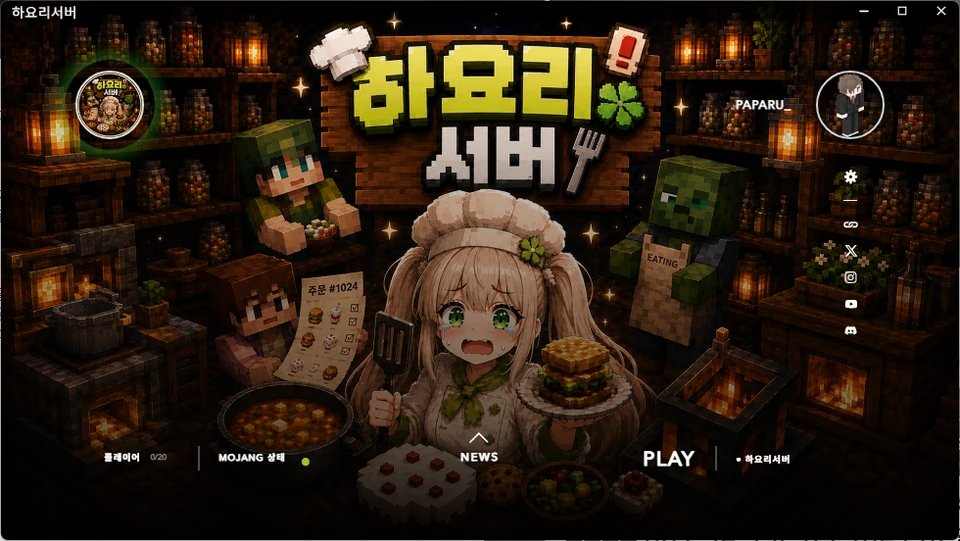

# 접속 방법

전용 **런처**로 접속합니다. 모드와 리소스팩은 런처가 자동으로 설치합니다.

1.  :material-message-text: **디스코드에 들어옵니다**{ .flow-title }

    **숲 쪽지로 전달드린 주소**로 디스코드 서버에 참가합니다.

2.  :material-download: **런처를 받습니다**{ .flow-title }

    디스코드 **‘런처 다운’ 채널**에서 런처를 내려받습니다.

3.  :material-account-key: **로그인합니다**{ .flow-title }

    런처를 실행하고 로그인합니다.

4.  :material-play: **시작하기를 누릅니다**{ .flow-title }

    서버에 접속됩니다.

!!! danger "다운로드 링크가 방송 화면에 노출되면 안 됩니다"
    런처 다운로드 주소가 **방송에 잡히지 않도록** 주의해 주세요.
    디스코드 창을 화면에 띄운 채로 방송하지 마시고,
    런처를 받는 동안에는 **화면 송출을 꺼주시기 바랍니다.**

!!! tip "서버 주소를 따로 입력하지 않습니다"
    런처가 접속까지 처리하므로 멀티플레이 목록에 서버를 추가할 필요가 없습니다.

## 접속 후

먼저 해야 할 일이 세 가지 있습니다.

[:octicons-arrow-right-24: 첫 접속 시 할 일 보기](first-steps.md)
