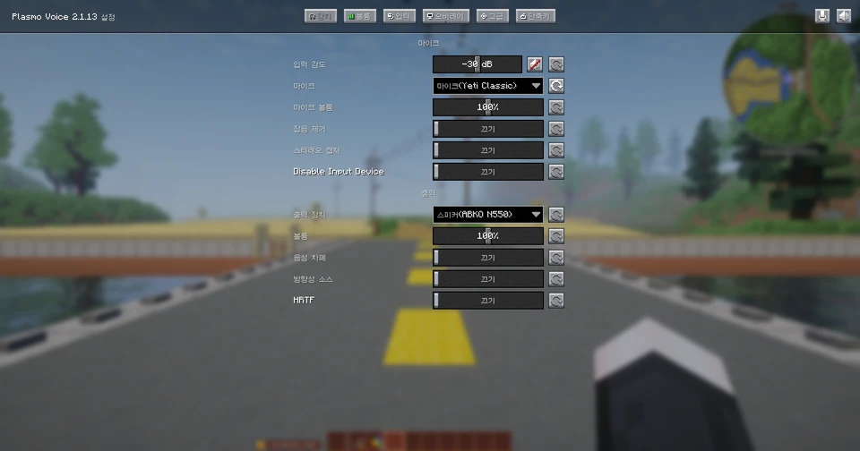
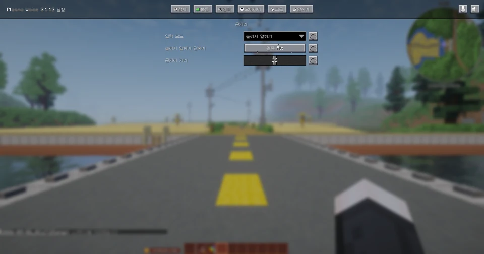
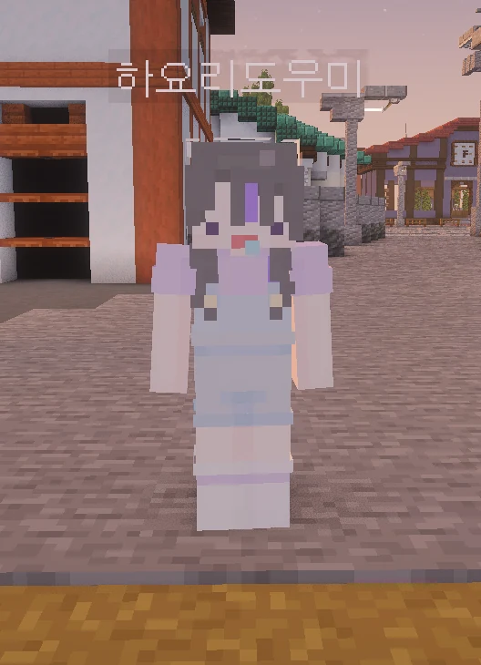

# 첫 접속 시 할 일

접속 후 다음 세 가지를 먼저 해주세요.

<div class="flow" markdown>

1.  :material-account-edit: **닉네임을 한글로 바꿉니다**{ .flow-title }

    스폰 지점 옆 **NPC**를 **우클릭**하면 변경할 수 있습니다.

2.  :material-microphone: **마이크와 API를 설정합니다**{ .flow-title }

    NPC 옆 **표지판**에 설정 방법이 적혀 있습니다.

3.  :material-file-document: **토지 문서를 받습니다**{ .flow-title }

    **마을 입구 도우미 NPC**에게 말을 걸면 받을 수 있습니다.

</div>

## 1. 닉네임 변경

스폰 지점 옆의 **NPC를 우클릭**하면 닉네임을 변경할 수 있습니다.
닉네임은 **한글**로 설정해야 합니다.


## 2. 마이크 · API 설정

NPC 옆에 세워진 **표지판**을 읽고 마이크와 API를 설정합니다.

| 설정 | 용도 |
|---|---|
| 마이크 | 보이스챗에 사용합니다 |
| API | 시청자 별풍선 주문을 받는 데 필요합니다 → [별풍선](../api/index.md) |

### API 연동

!!! danger "반드시 연동해 주세요"
    연동하지 않으면 시청자가 별풍선을 보내도 **주문이 들어오지 않습니다.**

숲 아이디를 넣어 연동한 뒤, 시작 명령어를 입력합니다.

```
/api 연동 숲 숲아이디
/api 시작
```

아이디는 **괄호 없이** 그대로 입력해야 합니다.

**장치 설정**



**입력 방식** — 눌러서 말하기와 음성 감지 중에 고르면 됩니다.



## 3. 토지 문서 받기

!!! danger "반드시 받아주세요"
    **마을 입구 도우미 NPC**에게 말을 걸어 **토지 문서**를 꼭 받아주세요.
    토지 문서로 땅을 구매하면 이동, 아이템 보관 등에 용이합니다.



[:octicons-arrow-right-24: 토지 문서 자세히 보기](land.md)

## 다음 단계

<div class="grid cards" markdown>

-   :material-map: **마을 둘러보기**

    ---

    요리 회관, 상점, 대장간이 있습니다.

    [:octicons-arrow-right-24: 마을 안내](servers.md)

-   :material-hammer-wrench: **일거리 고르기**

    ---

    채광 · 농사 · 낚시 · 목장 중에서 고르시면 됩니다.

    [:octicons-arrow-right-24: 일거리 보기](../work/index.md)

</div>
