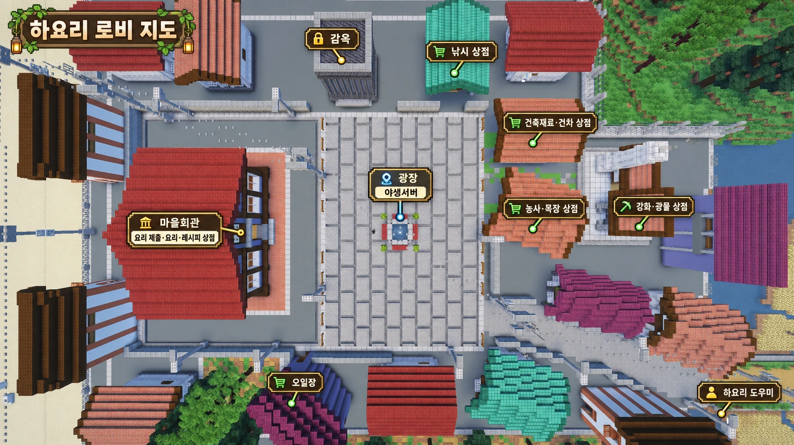

# 마을과 야생

서버는 **마을**과 **야생** 두 곳으로 나뉩니다.

-   :material-home-city: **마을 (로비)**

    ---

    요리 회관, 상점, 대장간이 있습니다.

-   :material-pine-tree: **야생**

    ---

    자원을 캐고 건축하는 곳입니다.
    토지 문서로 땅을 등록할 수 있습니다.

## 마을 지도

## 마을에 있는 것

### 요리 회관

서버의 중심 건물입니다.

| 할 수 있는 것 | 설명 |
|---|---|
| 레시피 구매 | 레시피북을 삽니다 → [레시피 시스템](../cooking/recipes.md) |
| 조리 도구 구매 | 도마·냄비·오븐 등을 삽니다 → [조리 도구](../cooking/tools.md) |
| 요리 제출 | 주문받은 요리를 냅니다 → [요리 제출](../cooking/submit.md) |
| 요리 판매 | 주문과 무관하게 판매합니다 |

### 대장간

도구를 **강화**하는 곳입니다. 광물 상점도 이곳에 있습니다.

[:octicons-arrow-right-24: 강화 보기](../shop/upgrade.md)

### 상점

| 상점 | 취급 품목 |
|---|---|
| 낚시 상점 | 물고기를 팝니다 |
| 건차 상점 | 토지 문서와 귀환석을 삽니다 |
| 농사 상점 | 경작지 등 농사 물품을 삽니다 |
| 목장 상점 | 유전자 미니 목장을 삽니다 |
| 광물 상점 | 광물을 팝니다 *(대장간 안에 있습니다)* |

[:octicons-arrow-right-24: 상점 자세히 보기](../shop/index.md)

## 야생

마인크래프트 기본 야생과 같습니다. 자원을 모으고 건축합니다.

### 땅 사기

**토지 문서**로 청크를 등록할 수 있습니다.

[:octicons-arrow-right-24: 토지 문서 보기](land.md)

## 마을로 돌아오기

야생에서 마을로 돌아올 때는 **귀환석**을 사용합니다.
건차 상점에서 구매할 수 있고, 별풍선 랜덤 박스에서도 나옵니다.

[:octicons-arrow-right-24: 귀환석 보기](../items/return-stone.md)
