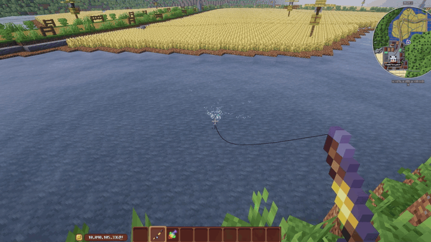
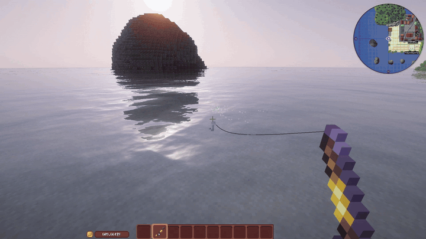
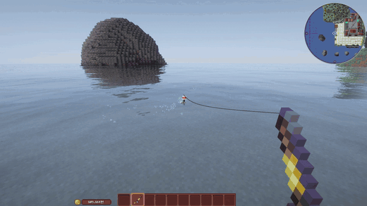

# 낚시

물고기와 요리 재료를 얻습니다.

## 미니게임

**낚시를 할 때마다 미니게임이 나옵니다.**
세 가지 중 하나가 무작위로 등장하며, **클리어해야 물고기가 잡힙니다.**

### 무지개 맞추기

**글자로 표시된 색**에 맞춰 우클릭하면 성공합니다.

### 타이밍 맞추기

**초록색**에 맞춰 우클릭하면 성공합니다.

### 구피 달리기

++shift++ 로 물고기를 당깁니다.
**결승선까지 끌고 오면** 성공입니다.

!!! warning "날뛸 때는 당기지 마세요"
    물고기가 **붉어지면서 날뛸 때** ++shift++ 를 누르면 줄 내구도가 급격히 떨어집니다.
    내구도를 유지하면서 끌고 와야 합니다.

## 판매처

잡은 물고기는 마을 **낚시 상점**에서 판매합니다.

[:octicons-arrow-right-24: 상점 안내](../shop/index.md)
