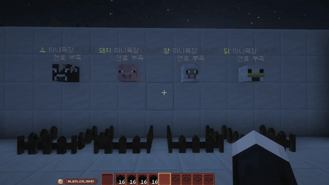

# 목장

!!! danger "동물 교배는 금지입니다"
    이 서버는 **동물 교배가 규칙으로 금지**되어 있습니다.
    고기가 필요할 때는 아래의 미니 목장을 이용합니다.

## 유전자 미니 목장

고기는 **유전자 미니 목장**으로 얻습니다.
**목장 상점**에서 구매할 수 있습니다.

### 설치

!!! warning "위로 4칸 이상 비어 있어야 합니다"
    머리 위 공간이 부족하면 설치되지 않습니다.

설치한 **동물 머리를 캐면** 다시 아이템으로 돌아옵니다. 옮겨서 다시 놓을 수 있습니다.

### 사용법

**석탄 블럭 한 개당 3분** 동안 작동합니다.
연료가 떨어지면 멈추므로 석탄 블럭을 채워 넣어야 합니다.

| 항목 | 내용 |
|---|---|
| 연료 | 석탄 블럭 |
| 작동 시간 | 석탄 블럭 1개당 **3분** |
| 설치 조건 | 위로 **4칸 이상** 여유 공간 |
| 회수 | 동물 머리를 캐면 아이템으로 반환 |

고기는 [육절기](../cooking/tools.md)로 손질해 부분육으로 만들 수 있습니다.
